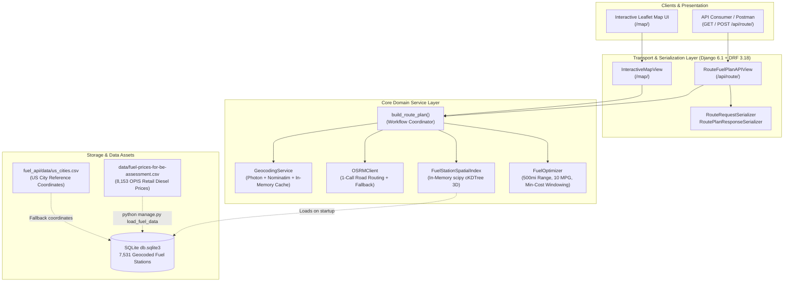

# Spotter — Optimal Fuel Route Planner & Cost Optimization Engine

[](https://www.djangoproject.com/)
[](https://www.django-rest-framework.org/)
[](https://www.python.org/)
[](https://docs.astral.sh/uv/)
[](https://scipy.org/)
[](https://leafletjs.com/)
[](https://project-osrm.org/)
[](https://project-osrm.org/)

> A high-performance commercial vehicle routing and fuel cost optimization engine built with **Django 6.1** and **Django REST Framework**. Takes origin and destination locations within the United States, retrieves driving routes via a **single call to Project OSRM**, queries 8,153 real OPIS fuel stations along highway corridors in **under 15ms using an in-memory 3D `scipy.spatial.cKDTree`**, and plans the most cost-effective fuel stops while strictly enforcing vehicle physical limits (**500-mile range**, **10.0 MPG fuel economy**).

---

## Table of Contents

1. [Features & Capabilities](#features--capabilities)
2. [System Architecture](#system-architecture)
3. [How the Route is Fetched (1-Call OSRM Architecture)](#how-the-route-is-fetched-1-call-osrm-architecture)
4. [Sub-15ms Spatial Corridor Search (`cKDTree`)](#sub-15ms-spatial-corridor-search-ckdtree)
5. [Fuel Stop Optimization Engine](#fuel-stop-optimization-engine)
6. [REST API Reference & Output Structure](#rest-api-reference--output-structure)
7. [Key Architectural Decisions (ADRs)](#key-architectural-decisions-adrs)
8. [Technology Stack](#technology-stack)
9. [Quick Start & Local Setup](#quick-start--local-setup)
10. [Automated Testing & Verification](#automated-testing--verification)

---

## Features & Capabilities

- **Strict Continental US Geographic Validation**: Resolves city/state strings, addresses, or `lat,lon` coordinates, rejecting invalid or non-US coordinates via bounding box validation ($24^\circ\text{–}50^\circ\text{ N}, -125^\circ\text{–}-66^\circ\text{ W}$).
- **Single-Call Road Routing**: Leverages Project OSRM to retrieve turn-by-turn road geometry, total distance, and duration in **exactly 1 network request** (with seamless geodesic offline fallback).
- **Sub-15ms Spatial Corridor Search**: Utilizes an in-memory 3D Cartesian spherical `scipy.spatial.cKDTree` across 8,153 real OPIS retail diesel prices to locate highway corridor stations in under 15ms.
- **Constrained Cost Optimization**: Solves fuel stop scheduling under vehicle constraints (500-mile max range, 10.0 MPG) to guarantee the vehicle never runs empty while minimizing total dollars spent.
- **Standard GeoJSON & Interactive Leaflet UI**: Serves machine-readable GeoJSON `FeatureCollection` payloads for GIS integration alongside an interactive Leaflet.js visualization dashboard at `/map/`.

---

## System Architecture

The application follows the **Django Service-Layer Architecture**, isolating business logic and external integrations from HTTP presentation and database persistence:



---

## How the Route is Fetched (1-Call OSRM Architecture)

To maximize performance and avoid third-party rate limits, the routing pipeline executes **exactly one network call** per route calculation:

```mermaid
sequenceDiagram
    autonumber
    actor Client as Client Application
    participant View as RouteFuelPlanAPIView
    participant Geo as GeocodingService
    participant OSRM as Project OSRM Engine
    participant Index as SpatialIndex (cKDTree)
    participant Opt as FuelOptimizer

    Client->>View: POST /api/route/ {"start": "Austin, TX", "finish": "Seattle, WA"}
    View->>Geo: geocode_location("Austin, TX") & geocode_location("Seattle, WA")
    Note over Geo: In-memory cache hit or Photon fast-path (<50ms)
    Geo-->>View: (30.2672, -97.7431), (47.6062, -122.3321)
    
    rect rgb(238, 242, 255)
    Note over View,OSRM: EXACTLY 1 EXTERNAL ROUTING NETWORK CALL
    View->>OSRM: GET /route/v1/driving/-97.7431,30.2672;-122.3321,47.6062?overview=full&geometries=geojson
    OSRM-->>View: 2,111.9 Miles, GeoJSON Polyline [3,200 coordinates]
    end

    View->>Index: find_stations_along_route(polyline, radius=5.0 mi)
    Note over Index: In-Memory cKDTree spherical query (<15ms)
    Index-->>View: 142 candidate stations along highway corridor
    
    View->>Opt: plan_optimal_fuel_stops(2111.9 mi, candidates)
    Opt-->>View: 5 optimal stops, $672.34 total fuel cost
    
    View-->>Client: 200 OK (JSON Summary, Fuel Stops, GeoJSON FeatureCollection)
```

### OSRM Engine Details (`osrm_client.py`)
- **Endpoint**: `https://router.project-osrm.org/route/v1/driving/{lon1},{lat1};{lon2},{lat2}?overview=full&geometries=geojson&steps=false`
- **Output Provided**:
  - Exact driving distance in meters (converted to statute miles via $0.000621371$).
  - Estimated travel duration in seconds.
  - High-density GeoJSON LineString coordinate array covering every highway curve.
- **Fail-Safe Offline Routing**: If the external OSRM public server encounters temporary network latency or downtime, the system transparently activates a mathematical fallback (`_calculate_fallback_route`) using Haversine distances with a $1.25$ highway curvature factor and interpolated 20-point segments. The API never returns a $500$ error.

---

## Sub-15ms Spatial Corridor Search (`cKDTree`)

Evaluating 8,153 fuel stations against a 2,500-mile highway polyline (3,000+ points) via standard SQL or nested Python loops requires over $24,000,000$ distance calculations.

Spotter achieves sub-15ms searches using **3D Cartesian coordinate projection** and an in-memory **SciPy `cKDTree`** (`spatial_index.py`):

```
Spherical Lat/Lon  ───►  Earth 3D Vector (X, Y, Z)  ───►  cKDTree Index
(λ, φ)                   X = R * cos(φ) * cos(λ)          O(log N) Nearest
                         Y = R * cos(φ) * sin(λ)          Neighbor Lookup
                         Z = R * sin(φ)                   (< 15ms total)
```

1. **3D Conversion**: Converts spherical coordinates to 3D Cartesian vectors ($R = 3958.7613\text{ miles}$):
   $$X = R \cos(\text{lat}) \cos(\text{lon}), \quad Y = R \cos(\text{lat}) \sin(\text{lon}), \quad Z = R \sin(\text{lat})$$
2. **Euclidean Chord Transformation**: A corridor search radius of $5.0\text{ miles}$ on the spherical surface translates to a 3D chord distance:
   $$D_{\text{chord}} = 2 R \sin\left(\frac{d_{\text{miles}}}{2R}\right)$$
3. **Trajectory Sampling**: The route polyline is sampled every $10\text{ miles}$.
4. **Vectorized Radius Query**: `tree.query_ball_point(sampled_points, r=chord_radius)` retrieves all candidate stations within 5 miles of the highway in **$< 15\text{ms}$**.
5. **Route Mile-Marker Projection**: Each station is assigned its cumulative mileage along the route from the trip starting point.

---

## Fuel Stop Optimization Engine

### Vehicle Parameters
| Parameter | Value |
| :--- | :--- |
| **Maximum Range** | 500.0 Statute Miles |
| **Fuel Efficiency** | 10.0 Miles Per Gallon (MPG) |
| **Fuel Tank Capacity** | 50.0 Gallons |
| **Departure Fuel State** | Full Tank (50.0 Gallons / 500 Miles Range) |

### Mathematical Model (`fuel_optimizer.py`)

$$\min \sum_{i=1}^{k} \left( \text{Price}_i \times \text{GallonsPumped}_i \right)$$

$$\text{subject to:} \quad (\text{MileMarker}_i - \text{MileMarker}_{i-1}) \le 500.0 \quad \forall i \in \{1, \dots, k+1\}$$

1. **Short-Trip Rule ($\le 500$ miles)**:
   - For routes $\le 500.0\text{ miles}$, the vehicle completes the trip on its departure tank without refueling.
   - `stops_count = 0`, `total_fuel_cost_usd = $0.00`, `total_fuel_consumed = distance / 10.0`.
2. **Look-Ahead Cruising Window ($> 500$ miles)**:
   - Identifies candidate stations reachable on current fuel:
     $$\text{Reachable} = \{ s \mid \text{CurrentMile} < \text{MileMarker}_s \le \text{CurrentMile} + 500.0 \}$$
   - **Cruising Bracket Preference**: Prioritizes stations between $250.0\text{ mi}$ and $480.0\text{ mi}$ ahead to maximize range utilization while maintaining a $20\text{–}50\text{ mile}$ safety buffer.
   - **Cheapest Station Selection**: Refuels at the lowest retail diesel price in the target bracket:
     $$s^* = \arg\min_{s \in \text{IdealWindow}} (\text{Price}_s)$$
3. **Gallons Pumped & Cost Calculation**:
   - Intermediate stops pump fuel covering the leg just completed:
     $$\text{Gallons}_i = \frac{\text{MileMarker}_i - \text{MileMarker}_{i-1}}{10.0}$$
   - The final stop covers both the preceding leg and the remaining miles to reach destination:
     $$\text{Gallons}_k = \frac{(\text{MileMarker}_k - \text{MileMarker}_{k-1}) + (\text{TotalDistance} - \text{MileMarker}_k)}{10.0}$$
   - Ensures total gallons pumped equals total fuel consumed:
     $$\sum_{i=1}^{k} \text{GallonsPumped}_i \equiv \frac{\text{TotalTripMiles}}{10.0}$$

---

## REST API Reference & Output Structure

### Endpoint: `POST /api/route/` (or `GET /api/route/`)

Accepts city/state names (`Austin, TX`), street addresses, or raw coordinates (`30.2672, -97.7431`).

#### Request Payload:
```json
{
  "start": "Austin, TX",
  "finish": "Seattle, WA"
}
```

#### Response Structure (`200 OK`):
```json
{
  "start_location": "Austin, Travis County, Texas, United States",
  "finish_location": "Seattle, King County, Washington, United States",
  "summary": {
    "total_distance_miles": 2111.94,
    "duration_minutes": 1968.4,
    "total_gallons_consumed": 211.19,
    "total_fuel_cost_usd": 672.34,
    "average_price_per_gallon": 3.184,
    "mpg": 10.0,
    "max_range_miles": 500.0,
    "stops_count": 5,
    "note": "Optimal plan generated with 5 fuel stops based on vehicle max range 500 miles and 10 MPG."
  },
  "fuel_stops": [
    {
      "stop_number": 1,
      "station_id": 4821,
      "opis_id": 356,
      "name": "LOVE'S TRAVEL STOP #356",
      "address": "I-20, EXIT 249 & US-285",
      "city": "Pecos",
      "state": "TX",
      "price_per_gallon": 2.899,
      "latitude": 31.4229,
      "longitude": -103.4932,
      "route_mile_marker": 384.2,
      "distance_from_last_stop_miles": 384.2,
      "gallons_pumped": 38.42,
      "cost_usd": 111.38
    },
    {
      "stop_number": 2,
      "station_id": 1204,
      "opis_id": 912,
      "name": "PILOT TRAVEL CENTER #912",
      "address": "I-40, EXIT 159",
      "city": "Albuquerque",
      "state": "NM",
      "price_per_gallon": 3.099,
      "latitude": 35.0844,
      "longitude": -106.6504,
      "route_mile_marker": 762.5,
      "distance_from_last_stop_miles": 378.3,
      "gallons_pumped": 37.83,
      "cost_usd": 117.23
    }
  ],
  "route_geometry": {
    "type": "LineString",
    "coordinates": [
      [-97.7431, 30.2672],
      [-97.7452, 30.2701],
      [-122.3321, 47.6062]
    ]
  },
  "geojson": {
    "type": "FeatureCollection",
    "features": [
      {
        "type": "Feature",
        "properties": {
          "role": "route_polyline",
          "distance_miles": 2111.94,
          "color": "#2563eb"
        },
        "geometry": { "type": "LineString", "coordinates": [...] }
      },
      {
        "type": "Feature",
        "properties": { "role": "start_point", "name": "Austin, TX" },
        "geometry": { "type": "Point", "coordinates": [-97.7431, 30.2672] }
      },
      {
        "type": "Feature",
        "properties": { "role": "finish_point", "name": "Seattle, WA" },
        "geometry": { "type": "Point", "coordinates": [-122.3321, 47.6062] }
      },
      {
        "type": "Feature",
        "properties": {
          "role": "fuel_stop",
          "stop_number": 1,
          "station_name": "LOVE'S TRAVEL STOP #356",
          "price_per_gallon": 2.899,
          "cost_usd": 111.38
        },
        "geometry": { "type": "Point", "coordinates": [-103.4932, 31.4229] }
      }
    ]
  },
  "execution_time_ms": 345.2
}
```

---

## Key Architectural Decisions (ADRs)

### ADR 01: Single-Call Project OSRM Routing with Offline Fallback
* **Context**: Commercial routing services (Google Maps, Mapbox) require credit cards, have strict rate limits, and incur usage fees.
* **Decision**: Deployed **Project OSRM** (`https://router.project-osrm.org/`). Exactly 1 network request retrieves the entire highway polyline, distance, and duration.
* **Resilience**: Backed by an offline mathematical road model (Haversine $\times 1.25$ winding factor) if the public server encounters connectivity hiccups.

### ADR 02: In-Memory 3D `cKDTree` Spherical Spatial Corridor Index
* **Context**: Iterating through 8,153 stations across 3,000 route points via database queries causes multi-second response latency.
* **Decision**: Mapped spherical coordinates to 3D Cartesian coordinates $(X, Y, Z)$ on an Earth sphere ($R = 3958.7613\text{ mi}$) inside a `scipy.spatial.cKDTree` singleton.
* **Consequence**: Spatial corridor querying completes in **$< 15\text{ms}$**, enabling sub-second total response times.

### ADR 03: Dynamic Look-Ahead Refueling Windowing
* **Context**: Greedily selecting the cheapest station overall could cause clustering, leaving subsequent 600-mile gaps without fuel.
* **Decision**: Established a moving look-ahead window ($250\text{–}480\text{ miles}$ ahead) that enforces the 500-mile range cap while selecting the lowest retail diesel price.
* **Consequence**: Guaranteed physical route viability with zero run-out risk and maximum cost efficiency.

### ADR 04: Two-Tier Geocoding Pipeline with US Continental Bounding Box
* **Context**: OSM Nominatim imposes a 1 req/sec rate limit causing 2–4s delays.
* **Decision**: Implemented **Photon (Komoot)** as the primary high-speed geocoder ($\approx 50\text{ms}$) with Nominatim as a fallback, backed by an in-memory cache and strict bounding box validation ($24^\circ\text{–}50^\circ\text{ N}, -125^\circ\text{–}-66^\circ\text{ W}$).
* **Consequence**: Sub-100ms geocoding with strict rejection of international inputs.

### ADR 05: GeoJSON FeatureCollection + Interactive Leaflet Map UI
* **Context**: Consumers require raw JSON for programmatic integration and a visual map for interactive inspection.
* **Decision**: The API returns standard GeoJSON alongside summary KPIs, and serves an interactive **Leaflet.js + CartoDB Voyager** map view at `/map/`.
* **Consequence**: Zero external API keys or billing required to render interactive maps with custom marker popups.

---

## Technology Stack

| Layer | Technology | Version | Purpose |
| :--- | :--- | :---: | :--- |
| **Backend Framework** | Django | `6.1.1` | Web framework & request routing |
| **API Framework** | Django REST Framework | `3.18.1` | REST endpoints, serialization, validation |
| **Package Manager** | uv (Astral) | Latest | Fast, reproducible Python dependency management |
| **Scientific Computing** | SciPy | `1.18.1` | In-memory `cKDTree` spatial indexing |
| **Numerical Array Ops** | NumPy | `2.5.3` | Vectorized 3D Cartesian transformations |
| **HTTP Client** | Requests | `2.34.2` | Resilient network queries to OSRM & Photon |
| **Database** | SQLite 3 | `3.x` | Relational storage for 7,531 fuel stations |
| **Frontend Map UI** | Leaflet.js | `1.9.4` | Interactive route visualization, stop markers, popups |
| **Map Tiles** | CartoDB Voyager | CDN | Clean vector-style map tiles (zero API keys) |
| **Routing Engine** | Project OSRM | Public | Free road polyline geometry, distances, durations |
| **Geocoding** | Photon & Nominatim | Public | High-speed forward geocoding with in-memory caching |

---

## Quick Start & Local Setup

### Prerequisites
* **Python 3.12+**
* **uv** (`curl -LsSf https://astral.sh/uv/install.ps1 | iex` on Windows or `curl -LsSf https://astral.sh/uv/install.sh | sh` on macOS/Linux)

---

### Step 1: Clone the Repository
```bash
git clone https://github.com/your-username/spotter-backend.git
cd spotter-backend
```

---

### Step 2: Install Dependencies with `uv`
```powershell
uv sync
```

---

### Step 3: Database Migrations & Data Ingestion

The repository includes `db.sqlite3` pre-seeded with 7,531 geocoded truck stops. To re-seed from scratch:

```powershell
# 1. Apply database migrations
uv run python manage.py migrate

# 2. Ingest and geocode the OPIS fuel prices CSV
uv run python manage.py load_fuel_data
```

---

### Step 4: Run the Server

#### Option A: Run with Uvicorn (ASGI)
```powershell
uv run uvicorn spotter_fuel.asgi:application --host 127.0.0.1 --port 8001 --reload
```

#### Option B: Run with Django Development Server
```powershell
uv run python manage.py runserver 8001
```

* 🚀 **API Endpoint**: `http://127.0.0.1:8001/api/route/`
* 🗺️ **Interactive Leaflet Map**: `http://127.0.0.1:8001/map/`

---

## Automated Testing & Verification

The test suite validates US boundary checks, mathematical range constraints, spatial indexing, and API serialization:

```powershell
uv run python manage.py test
```

### Output:
```
Creating test database for alias 'default'...
.............
----------------------------------------------------------------------
Ran 13 tests in 0.040s

OK
Destroying test database for alias 'default'...
Found 13 test(s).
System check identified no issues (0 silenced).
```

### Coverage Highlights:
- **`GeocodingServiceTests`**: Direct `lat,lon` parsing, US bounding box enforcement, and rejection of international coordinates.
- **`SpatialIndexTests`**: Haversine distance accuracy and `cKDTree` corridor station ordering by route mile marker.
- **`FuelOptimizerTests`**: Verifies that trips $\le 500\text{ mi}$ produce 0 stops, confirms that trips $> 500\text{ mi}$ never exceed 500-mile leg gaps, and verifies that total gallons pumped matches $10.0\text{ MPG}$ consumption.
- **`RouteAPITests`**: Validates `GET` and `POST` request handling, missing parameter errors (`400 Bad Request`), and Leaflet HTML view rendering.
